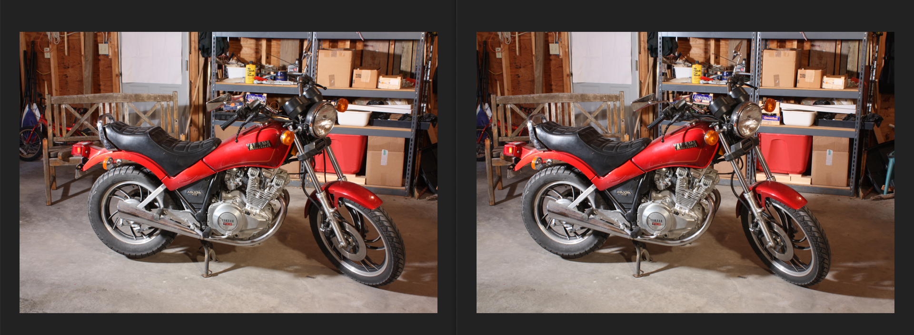
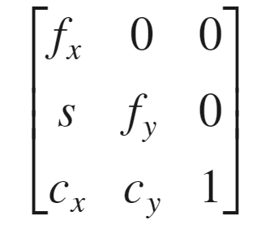
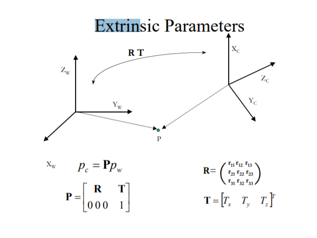
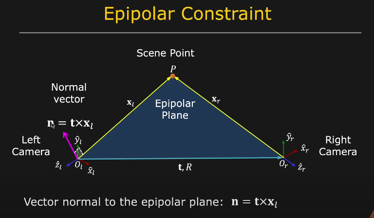

# Stereo_Reconstruction      

The general idea of the stereo reconstruction algorithm which reconstructs depth information from two camera views. 

# Stereo Pair

A stereo-pair image contains two views of a scene side by side. One of the views is intended for the left eye and the other for the right eye.




## How to run the code :- 


~~~ bash
git clone https://github.com/Pranav2442/Stereo_Reconstruction.git
~~~  
  
  

1) Specify the file paths of the images in <code> img_on_left </code>  and <code> img_on right </code>.
2) Edit the file name as per your need.


# Results 

| Left View | Right View | Disparity Map  | 3D Reconstruction |
| -------- | -------- | -------- | -------- |
|    |  |  |        |
|    |  |  |        |
|    |  |  |        |
|    |  |  |        |
|    |  |  |        |


<!--## Types of Projections:-

### 1) Eucledian or Isometric transformation:-<br/>

Whenever Image is transformed or rotated around any point is called as Eucledian transfrom.Eucledian transform is a subset of affine transform.

&emsp;&emsp;&emsp;a) Distance is Preserved.<br/>

&emsp;&emsp;&emsp;b) Angles are preserved.<br/>

&emsp;&emsp;&emsp;c) Shapes are preserved.<br/>

<br/>
<br/>

### 2) Affine Transformation:-<br/>

A transformation that can be expressed in the form of a matrix multiplication (linear transformation) followed by a vector addition (translation).There are 6 degrees of freedom.2 Degrres for translation,1 for rotation, 1 for scaling,1 for scaling direction and 1 for scaling ratio.Using 2*3 matrix It can be rotated,sheared,translated and scale the image.<br/>

&emsp;&emsp;&emsp;a) Square won't be square <br/>

&emsp;&emsp;&emsp;b) Parallel lines are preserved but many be sheared.<br/>

### 3) Projective Transform :- <br/>

A projective transformation is a transformation used in projective geometry: it is the composition of a pair of perspective projections. It describes what happens to the perceived positions of observed objects when the point of view of the observer changes. 

## Difference Between Projective and Affine Transformations :- <br/>
<br/><br/>
&emsp;&emsp;&emsp;a) In the projective transformation parallelism,length and angles are not preserved but it can preserve collinearity and incidence.<br/>

&emsp;&emsp;&emsp;b) As the Affine transformation is a special case of the projective transformation,it has the same .It preserves parallelism. <br/>

## Camera Parameters :- 

Camera parameters are the parameters used in a camera  to describe the mathematical relationship between the 3D coordinates of a point in the scene from which the light comes from and the 2D coordinates of its projection onto the image plane. There are 2 types of camera Parameters Intrinsic and Extrinsic.

### Intrinsic Parameters :-  <br/>

Characterize the transformation from image plane coordinates to pixel coordinates, in each camera.The intrinsic parameters include the focal length, the optical center, also known as the principal point, and the skew coefficient. The camera intrinsic matrix, K, is defined as <br/>

 

### Extrinsic Parameters :- <br/>

It defines the location and orientation of the camera with respect to the world frame.<br/>
-->
## Epipolar Geometry :- <br/>


The epipolar geometry is the intrinsic projective geometry between two views. It is
independent of scene structure, and only depends on the cameras’ internal parameters
and relative pose.  It is the representation of 1 camera with repect to other camera.Every scene lies on unique epipolar plane.<br/>




## Disparity and Depth :- <br/>

Disparity map refers to the apparent pixel difference or motion between pair of stereo images.Closing and Opening each eye simultaneouly which shows the change in distance. Object which are closer will appear to jump a significant distance and objects which are far will move a little bit.Difference in location of objects in correspoding two images as seen by the left and right eye.Using disparity depth can be obtained.Disparity map is basically a pixel difference between a pair of stereo images.<br/>


<!--## Algorithm to obtain Disparity map:- <br/>
1)Import essential libraries such as opencv and pyplot from matplotlib.<br/>
<br/>
2) Take 2 images (left and Right view) as input in Gray format<br/>
<br/>
3) We can use StereoBM_create or StereoSGBM_create anyone will do fine according to our requirements.<br/>
<br/>&emsp;&emsp; a) StereoBM_create takes only two parameters, BM stands for block matching algorithm.<br/>
<br/>&emsp;&emsp; b) StereoSGBM_create take more than two parameters.<br/>
<br/>
4) Refer the calibration.txt file to tune the parameters.<br/>
<br/>
5) Use Stereo.compute to obtained the disparity map.<br/>
<br/>
6) Change the type of the map because it return 16bit signed single channel image,CV_16s containing a disparity map scaled by 16.Hence it is essential to convert it to CV_32F and scale it down 16 times. <br/>
<br/>
7) Normalize the disparity map by Number of disparity <br/>
<br/>
8) show the disparity map using matplotlib , plt.imshow() <br/>
<br/>
<br/> &emsp;&emsp; a) "jet" use to show heat map effect .<br/>
<br/> &emsp;&emsp; b) "grey" use to show map in Gray color.<br/>-->


## Algorithm of Main Program :- 

1) Install Essential libraries.<br/>
<br/>

<code>  pip install matplotlib </code>


<code> pip install opencv-python </code> <br/>
<br/>
2) Take 2 images (left and Right view) as input in Gray format<br/>
<br/>
3) Find disparity map using <code>StereoSGBM_create</code> which takes many parameters as mentioned in calibration.txt and tune the map according to the requirements.<br/>
<br/>
4) Change the type of the map because it return 16bit signed single channel image,CV_16s containing a disparity map scaled by 16.Hence it is essential to convert it to CV_32F and scale it down 16 times. <br/>
<br/>
5) Normalize the disparity map by Number of disparity <br/>
<br/>
6) Now find the <code>Q</code> (4 X 4 perspective transformation matrix using calibration.txt)<br/>
<!--&emsp;&emsp; &emsp;&emsp; &emsp;&emsp; a) f=focal length <br/>
&emsp;&emsp; &emsp;&emsp; &emsp;&emsp; b) b=baseline <br/>-->
<br/>
7) Use <code>reprojectimageto3d</code> by passing the parameters such as disparity map and Q matrix.<br/>
<br/>
8) Now convert the file into <code>PLY</code> format<br/>
<br/>
9) Visualize the same file in Meshlab software after conversion.<br/>
<br/>

10)We can also plot it using **matplotlib**.<br/>
<br/>

<!--<br/> &emsp;&emsp; a) Number of disparities (numDisparities):-<br/>
&emsp;&emsp; &emsp;&emsp; &emsp;&emsp; &emsp;&emsp; Sets the range of disparity values to be searched. The overall range is from minimum disparity value to minimum 
disparity value + number of disparities. <br/>
<br/>
<br/> &emsp;&emsp; b)  Block size (blockSize):-<br/>
&emsp;&emsp; &emsp;&emsp; &emsp;&emsp; &emsp;&emsp; Size of the sliding window used for block matching to find corresponding pixels in a rectified stereo image pair. A higher value indicates a larger window size. <br/>
<br/>
<br/> &emsp;&emsp; c)  Pre-Filter Type (preFilterType):-<br/>
&emsp;&emsp; &emsp;&emsp; &emsp;&emsp; &emsp;&emsp;Parameter to decide the type of pre-filtering to be applied to the images before passing to the block matching algorithm. This step enhances the texture information and improves the results of the block matching algorithm. <br/>
<br/>
<br/> &emsp;&emsp; d)  Pre-filter size (preFilterSize):-<br/>
&emsp;&emsp; &emsp;&emsp; &emsp;&emsp; &emsp;&emsp;Window size of the filter used in the pre-filtering stage.<br/>
<br/>
<br/> &emsp;&emsp; d)  Pre-filter cap (preFilterCap):-<br/>
&emsp;&emsp; &emsp;&emsp; &emsp;&emsp;Limits the filtered output to a specific value.<br/>
<br/>
<br/> &emsp;&emsp; e)  Speckle range (speckleRange) :-<br/>
&emsp;&emsp; &emsp;&emsp; &emsp;&emsp; Speckles are produced near the boundaries of the objects, where the matching window catches the foreground on one side and the background on the other. To get rid of these artifacts we apply speckle filter.<br/>
<br/>-->

<!--~~~ bash
  
  ply_header = '''ply
	format ascii 1.0
	element vertex %(vert_num)d
	property float x
	property float y
	property float z
	property uchar blue
	property uchar green
	property uchar red
	end_header
	'''
with open('bike.ply', 'w') as f:
	f.write(ply_header %dict(vert_num = len(xyz)))
	np.savetxt(f, xyz, '%f %f %f %d %d %d')
  ~~~
  
<br/>
 -->


<!--# Libraries Used :-

## Opencv

[OpenCV](https://opencv.org/) is the huge open-source library for the computer vision, machine learning, and image processing and now it plays a major role in real-time operation

## Installation

Use the package manager [pip](https://pip.pypa.io/en/stable/) to install Opencv.

```bash
pip install opencv-python
```
## Matplotlib:-
[Matplotlib](https://matplotlib.org/) is a comprehensive library for creating static, animated, and interactive visualizations in Python.

```bash
pip install matplotlib
```-->
## links of Important Functions
### OpenCV Functions:
For [Stereosgbm](https://docs.opencv.org/4.5.3/d2/d85/classcv_1_1StereoSGBM.html).


For all other [Functions](https://docs.opencv.org/4.5.2/d6/d00/tutorial_py_root.html)
### Matplotlib Functions:

For [colormap](https://matplotlib.org/stable/tutorials/colors/colormaps.html)


For [3D plots](https://matplotlib.org/2.0.2/mpl_toolkits/mplot3d/tutorial.html)

<!--## How to run the code :- 


~~~ bash
git clone https://github.com/Pranav2442/Stereo_Reconstruction.git
~~~  
  
  

1) Specify the file paths of the images in <code> img_on_left </code>  and <code> img_on right </code>.
2) Edit the file name as per your need.


# Results 

| Left View | Right View | Disparity Map  | 3D Reconstruction |
| -------- | -------- | -------- | -------- |
|    |  |  |        |
|    |  |  |        |
|    |  |  |        |
|    |  |  |        |
|    |  |  |        |-->


<!--### Video

<!--https://user-images.githubusercontent.com/74892541/136580053-341a3c40-34ff-4c78-b661-b45df25f9ec2.mp4-->


                                      
